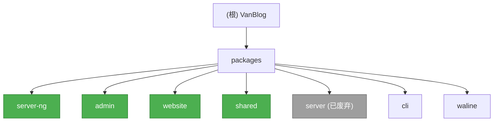

# CLAUDE.md

**最后更新时间**: 2025-12-09 02:50:35 CST

---

## 变更记录 (Changelog)

### 2025-12-09 - 架构师初始化

- 完成仓库初始化扫描，识别 7 个核心模块
- 创建根级与模块级 CLAUDE.md 文档结构
- 生成模块结构图与导航面包屑
- 覆盖率：已扫描核心配置、入口文件、类型系统与模块结构

---

## 项目愿景

VanBlog 是一个现代化的个人博客系统，包含管理后台、公开网站和 API 服务器。本仓库为 [CornWorld](https://github.com/CornWorld) 维护的分支版本。

**核心特性**：

- 基于 Drizzle ORM + SQLite 的轻量级数据层
- ts-rest 驱动的类型安全 API 契约
- 单一数据源（Single Source of Truth）类型系统
- 模块化插件架构
- 高测试覆盖率（80% 阈值）

---

## 架构总览

### 技术栈

| 层级         | 技术选型                               | 版本要求                       |
| ------------ | -------------------------------------- | ------------------------------ |
| **包管理器** | pnpm workspace                         | >=10.x                         |
| **运行时**   | Node.js                                | >=22 (server-ng), >=18 (admin) |
| **API 服务** | NestJS 11 + ts-rest                    | -                              |
| **数据库**   | Drizzle ORM + SQLite                   | -                              |
| **前端框架** | React 19 (admin), Next.js 15 (website) | -                              |
| **构建工具** | Vite 6-7.x, Next.js 15.x               | -                              |
| **测试框架** | Vitest                                 | 80% 覆盖率阈值                 |
| **代码质量** | ESLint 9 (flat config) + Prettier      | -                              |

### 类型系统：单一数据源设计

```
Drizzle 表定义 (packages/shared/src/runtime/db.ts)
      ↓ drizzle-zod
Zod Schema (packages/shared/src/runtime/schema.ts)
      ↓
ts-rest Contracts (packages/shared/src/contracts/*.contract.ts)
      ↓
前端（类型推导）+ 后端（运行时校验）
```

**命名约定**：

| 层级       | 前缀 | 用途          | 示例                            |
| ---------- | ---- | ------------- | ------------------------------- |
| **数据库** | `$`  | 数据库操作    | `$User`, `$UserIns`, `$UserUpd` |
| **API**    | 无   | API 请求/响应 | `User`, `UserReq`, `UserPatch`  |

- `$Entity` - SELECT schema（从数据库读取）
- `$EntityIns` - INSERT schema（写入数据库）
- `$EntityUpd` - UPDATE schema（更新数据库）
- `Entity` - API 响应（通常是去除敏感字段的 `$Entity`）
- `EntityReq` - API 请求体（创建）
- `EntityPatch` - API 请求体（更新）

---

## 模块结构图



---

## 模块索引

| 模块          | 路径                  | 职责                                     | 状态      | 语言       | 文档                                        |
| ------------- | --------------------- | ---------------------------------------- | --------- | ---------- | ------------------------------------------- |
| **server-ng** | `packages/server-ng/` | NestJS API 服务器 (Drizzle ORM, ts-rest) | 🟢 活跃   | TypeScript | [CLAUDE.md](./packages/server-ng/CLAUDE.md) |
| **admin**     | `packages/admin/`     | React 19 + Vite + Ant Design 管理后台    | 🟢 活跃   | TypeScript | [CLAUDE.md](./packages/admin/CLAUDE.md)     |
| **website**   | `packages/website/`   | Next.js 15 公开博客（SSG/ISR）           | 🟢 活跃   | TypeScript | [CLAUDE.md](./packages/website/CLAUDE.md)   |
| **shared**    | `packages/shared/`    | 类型契约、Schema、工具（单一数据源）     | 🟢 活跃   | TypeScript | [CLAUDE.md](./packages/shared/CLAUDE.md)    |
| **server**    | `packages/server/`    | 遗留 NestJS + Mongoose 服务器            | 🔴 已废弃 | TypeScript | [CLAUDE.md](./packages/server/CLAUDE.md)    |
| **cli**       | `packages/cli/`       | 命令行工具                               | 🟡 维护中 | JavaScript | [CLAUDE.md](./packages/cli/CLAUDE.md)       |
| **waline**    | `packages/waline/`    | 评论系统                                 | 🟡 维护中 | JavaScript | [CLAUDE.md](./packages/waline/CLAUDE.md)    |

**图例**：

- 🟢 活跃开发中
- 🟡 维护模式
- 🔴 已废弃/即将移除

---

## 运行与开发

### 环境要求

```bash
# Node.js
node --version  # >= 22 (server-ng), >= 18 (admin/website)

# pnpm
pnpm --version  # >= 10.x
```

### 安装依赖

```bash
pnpm i
```

### 开发命令

```bash
# 启动所有服务
pnpm dev                    # server-ng (3050) + admin (3002)

# 单独启动服务
pnpm dev:server             # server-ng only
pnpm dev:admin              # admin only
pnpm dev:website            # website only (3001)
```

### 构建命令

```bash
pnpm build                  # 所有包
pnpm build:server           # server-ng
pnpm build:admin            # admin
pnpm build:website          # website
```

### 测试命令（server-ng）

```bash
# 单元测试
pnpm --filter @vanblog/server-ng test

# E2E 测试
pnpm --filter @vanblog/server-ng test:e2e

# 覆盖率报告
pnpm --filter @vanblog/server-ng test:cov

# 运行单个测试文件
pnpm --filter @vanblog/server-ng test path/to/file.spec.ts
```

### 数据库命令（server-ng 使用 Drizzle + SQLite）

```bash
pnpm --filter @vanblog/server-ng db:generate  # 生成迁移文件
pnpm --filter @vanblog/server-ng db:push      # 推送 Schema 到数据库
pnpm --filter @vanblog/server-ng db:studio    # 打开 Drizzle Studio
```

### 代码质量

```bash
pnpm lint                   # 检查所有包
pnpm lint --fix             # 自动修复
```

---

## 测试策略

### 覆盖率要求

- **server-ng**: 80% 覆盖率阈值（Vitest + v8）
- **admin**: 组件测试（Vitest）
- **website**: 少量测试（Vitest 3.0.8）

### 测试工具

- **框架**: Vitest（server-ng, admin, website）
- **E2E**: Vitest E2E 配置（server-ng）
- **覆盖率**: v8 provider

### CI/CD

- 测试报告：JUnit XML（CI Artifact）
- 覆盖率报告：lcov, html, json-summary

---

## 编码规范

### ESLint 配置

- **版本**: ESLint 9 (flat config)
- **配置文件**: `eslint.config.js`
- **格式化**: Prettier 3.6.2

### TypeScript 配置

- **基础配置**: `tsconfig.base.json`
- **模块配置**: 各 package 继承基础配置
- **严格模式**: 启用

### 目录结构约定

```
packages/
├── server-ng/
│   ├── src/
│   │   ├── modules/          # 功能模块
│   │   ├── core/             # 核心功能（filters, interceptors, guards）
│   │   ├── config/           # 配置管理
│   │   ├── database/         # 数据库连接
│   │   └── shared/           # 共享工具
│   ├── test/                 # 测试文件
│   └── plugins/              # 插件目录
├── shared/
│   └── src/
│       ├── contracts/        # ts-rest 契约
│       ├── runtime/          # Zod Schema + Drizzle 表
│       ├── type/             # 纯类型导出
│       └── drizzle/          # Drizzle 工具
└── admin/
    └── src/
        ├── pages/            # 页面组件
        ├── components/       # 通用组件
        └── services/         # API 服务
```

---

## Shared Package 使用指引

### 导出路径

| 导出路径                    | 内容                     | 使用场景     |
| --------------------------- | ------------------------ | ------------ |
| `@vanblog/shared`           | contracts + schemas      | 主入口       |
| `@vanblog/shared/type`      | 纯类型（0 字节 JS）      | 前端类型导入 |
| `@vanblog/shared/runtime`   | Zod schemas + Drizzle 表 | 后端校验     |
| `@vanblog/shared/contracts` | ts-rest 契约             | API 定义     |
| `@vanblog/shared/drizzle`   | Drizzle 数据库工具       | DB 操作      |

### 前端使用示例

```typescript
import { initClient } from '@ts-rest/core';
import { contract } from '@vanblog/shared';

const client = initClient(contract, { baseUrl: '/api' });
const { body: articles } = await client.article.findAll();
// articles 自动推导为 ArticleList 类型
```

### 后端使用示例

```typescript
import { $User, $UserIns } from '@vanblog/shared/drizzle';
import { db } from './database';

// 插入数据
await db.insert($User).values({ ... });

// 查询数据
const users = await db.select().from($User);
```

---

## AI 使用指引

### 修改代码时的注意事项

1. **类型优先修改 shared package**：
   - 先更新 `packages/shared/src/runtime/db.ts`（Drizzle 表）
   - 自动生成 Zod Schema
   - 更新 `packages/shared/src/contracts/*.contract.ts`（ts-rest 契约）
   - 最后更新前后端实现

2. **遵循命名约定**：
   - 数据库层：`$Entity`, `$EntityIns`, `$EntityUpd`
   - API 层：`Entity`, `EntityReq`, `EntityPatch`

3. **测试优先**：
   - 先编写/更新测试文件
   - 确保覆盖率不低于 80%（server-ng）
   - 运行 `pnpm test:cov` 验证

4. **模块化原则**：
   - 新功能优先作为 NestJS 模块（server-ng/src/modules/）
   - 考虑是否可以作为插件（server-ng/plugins/）

5. **文档同步更新**：
   - 更新模块级 CLAUDE.md
   - 更新 API 文档（Swagger/OpenAPI）

### 常见任务

#### 添加新 API 端点

1. 在 `packages/shared/src/contracts/` 添加契约
2. 在 `packages/server-ng/src/modules/` 实现控制器
3. 更新 Swagger 文档注解
4. 编写单元测试

#### 添加新数据表

1. 在 `packages/shared/src/runtime/db.ts` 定义表
2. 运行 `pnpm --filter @vanblog/server-ng db:generate`
3. 运行 `pnpm --filter @vanblog/server-ng db:push`
4. 更新相关契约与 Schema

#### 修改前端页面

1. 确认 API 契约（`@vanblog/shared`）
2. 更新 admin 或 website 组件
3. 测试响应式布局与国际化

---

## 关键配置文件

| 文件                                   | 用途                 |
| -------------------------------------- | -------------------- |
| `pnpm-workspace.yaml`                  | pnpm workspace 配置  |
| `tsconfig.base.json`                   | TypeScript 基础配置  |
| `eslint.config.js`                     | ESLint flat 配置     |
| `.prettierrc.js`                       | Prettier 配置        |
| `packages/server-ng/drizzle.config.ts` | Drizzle 配置         |
| `packages/server-ng/vitest.config.ts`  | Vitest 配置          |
| `packages/admin/vite.config.ts`        | Admin Vite 配置      |
| `packages/website/next.config.js`      | Website Next.js 配置 |

---

## 扩展阅读

- [Drizzle ORM 文档](https://orm.drizzle.team/)
- [ts-rest 文档](https://ts-rest.com/)
- [NestJS 文档](https://nestjs.com/)
- [Next.js 15 文档](https://nextjs.org/docs)
- [React 19 文档](https://react.dev/)
