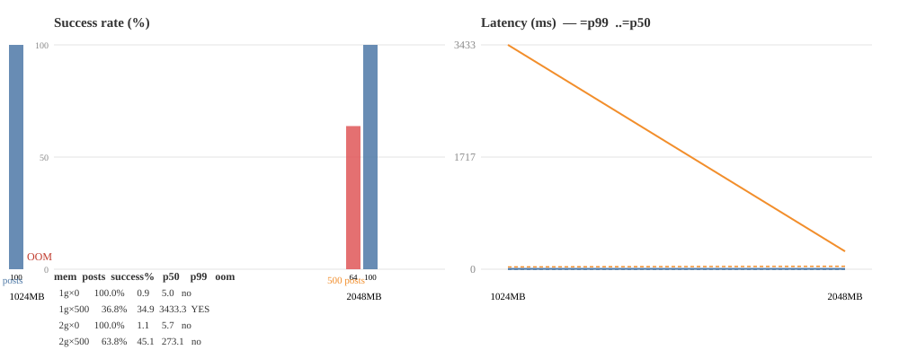

# Vanblog Benchmark

对 vanblog 容器做**真实负载压测**，回答"多少内存能扛住多少 QPS"。

## 架构

```
┌──────────────────────────────┐    ┌──────────────────────────────┐
│  bench-server 容器            │    │  bench-client 容器             │
│  （vanblog:bench-prod 镜像）  │    │  （vegeta + 挂载 linux 二进制）│
│                              │    │                               │
│  cgroup: --memory=<LIMIT>    │    │  cgroup: 独立（无内存限制）      │
│  │                          │    │                               │
│  ├─ Caddy  :8080  (/api→PB) │◄───│  共享 netns（连 :8080）          │
│  ├─ PB     127.0.0.1:8090   │    │   走真实 Caddy 反代链路          │
│  │  (GOMEMLIMIT=cgroup×80%) │    │                               │
│  └─ theme  127.0.0.1:4321   │    │   用 vegeta 恒速攻击              │
└──────────────────────────────┘    └──────────────────────────────┘
        `--network container:bench-server` 共享 netns

```

**关键点**：

1. **服务端受限**（`--memory=<N>`），**压测端独立**（无内存限制）——测的是真实服务端能力，压测端不抢资源。
2. 走 **Caddy :8080** 反代 PB——真实用户路径（也是 SSRF 安全的路径）。
3. vegeta 是 **Go 单文件二进制**（放 `bench/bin/`），不依赖外网拉镜像。
   > vegeta 二进制未提交（约 10MB，避免仓库膨胀）。首次运行前自行下载：
   >
   > ```bash
   > # 按宿主架构选一（容器是 arm64 则用 arm64）
   > curl -L -o bench/bin/vegeta-linux-arm64 \
   >   https://github.com/tsenart/vegeta/releases/download/v12.13.0/vegeta_12.13.0_linux_arm64.tar.gz
   > tar -xzf - -C bench/bin && mv bench/bin/vegeta bench/bin/vegeta-linux-arm64
   > ```
4. 镜像 `vanblog:bench-prod` 含 GOMEMLIMIT 推导 entrypoint + hooksPool=64 + pprof。

## 流偏好

1. **corpus**: `fetch-corpus.mjs` 从 HN / arXiv 抓真实文本 → `corpus.jsonl`（真正的文章，非 dummy）
2. **seed**: `seed.mjs` 将语料灌入 vanblog（分类/标签/文章）
3. **matrix**: `run-bench.sh` 循环内存限制 × 文章数 × (重复)，每轮起 server + vegeta 压测
4. **summarize**: `summarize.py` 汇总 + 出 CSV/图

## 使用

先构建 bench-prod 镜像（一次性）：

```bash
docker build --target prod -t vanblog:bench-prod .
```

拉语料（一次性，可反复）：

```bash
node bench/fetch-corpus.mjs 1000 > bench/corpus.jsonl
```

跑矩阵：

```bash
cd bench
# 内存(1g 2g) × 文章数(0 500)，每轮 45s，vegeta 打 500 QPS
BENCH_QPS=500 BENCH_DUR=45 BENCH_REPEAT=1 bash run-bench.sh "1g 2g" "0 500"
```

汇总 & 画图：

```bash
python3 summarize.py results/20260828-XXXXXXX --csv out.csv --plot out.png
```

## 矩阵变量

| 变量         | 说明               | 默认                 |
| ------------ | ------------------ | -------------------- |
| MEM_LIST     | 服务端内存限制列表 | `1g 2g`              |
| POSTS_LIST   | 文章数列表         | `0 500`              |
| BENCH_QPS    | 目标 QPS           | 500                  |
| BENCH_DUR    | 每轮秒数           | 120                  |
| BENCH_REPEAT | 每配置重复         | 3                    |
| BENCH_IMAGE  | 服务端镜像         | `vanblog:bench-prod` |

## 关键发现（2026-08，vegeta 版）

> ⚠️ 早期用自写 Node 客户端的矩阵数据**不可信**——那个客户端打不满目标 QPS
> （固定并发 + await 节流上限 ~400 QPS），且 GOMEMLIMIT 因 entrypoint 未正确
> 烧进镜像而失效。改用 vegeta + 重建镜像后的数据才可靠。

### 1000 QPS 稳态（真实数据，走 Caddy 链路）

| 内存 | 文章数 | QPS  | success   | p50    | p99    | OOM     |
| ---- | ------ | ---- | --------- | ------ | ------ | ------- |
| 1g   | 0      | 1000 | 100.0%    | 0.9ms  | 5.0ms  | no      |
| 1g   | 500    | 1000 | **36.8%** | 34.9ms | 3433ms | **YES** |
| 2g   | 0      | 1000 | 100.0%    | 1.1ms  | 5.7ms  | no      |
| 2g   | 500    | 1000 | **63.8%** | 45.1ms | 273ms  | no      |



### 结论

1. **空库扛 1000 QPS 很轻松**：1g 内存 p99=5ms，100% 成功。
2. **数据量是内存杀手**：加 500 篇真实文章后，1g 直接 OOM、2g 也降级到 63.8%。
3. **扛真实负载的 1000 QPS 需要 ≥2g**，且 2g 仍有余裕结果（p99 273ms）。
4. **瓶颈主要是查询负载**（timeline/feed 序列化 + JS hooks），亲切内存收益有限——
   优化方向应是查询/缓存，而非单纯加内存。

### 修复验证

本套基建同时验证了 3 个正确修复：

- **GOMEMLIMIT = cgroup×80%**（entrypoint 推导）——修复了无限制时的 OOM
- **hooksPool=64 + 并发 semaphore**——修复 goja VM pool 溢出泄漏
- **GOGC=50**——突发流量下更积极回收
